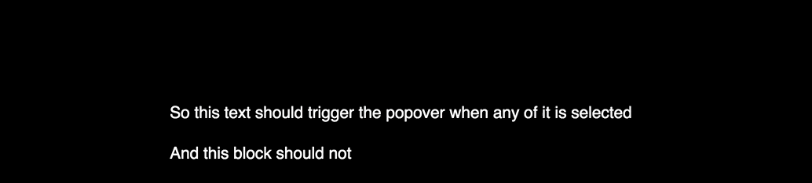

# react-text-selection-popover



As it says on the tin. This module provides a way to render a popover/tooltip style component when text is selected.

> You'll need React.16.3 or higher to use this btw. If you strongly disagree please open [an issue](issues/new)

[](https://www.npmjs.com/package/react-text-selection-popover) [](https://standardjs.com)

## Install

```bash
npm install --save react-text-selection-popover
```

## Usage

The simplest way to use react-text-selection-popover is with 0 props just like this:
```jsx
<Popover><MySweetComponent /></Popover>
```

This will display the popover when any text on the page is selected.

### Restricting selection to a component

By default, any text within `document` (or in other words - the entire page) will trigger the Popover. To restrict it you can define the `selectionRef` prop. Just pass a React ref to it:

```jsx
constructor(props) {
  super(props)
  this.ref = React.createRef()
}

render() {
  return <div>
    <p ref={this.ref}>This text will trigger the popover</p>
    <Popover selectionRef={this.ref}>Hello there</Popover>
  </div>
}
```

### Positioning the Popover

Since `1.0`, positioning is completely configurable via the `placementStrategy` prop. By default, the popover gets centered above or below the text selection (useful for inline toolbars in text editors like Medium) but you're not tied in to this behaviour.

Alternative strategies are in the [`lib`](lib) folder of the package.

Here's how you use a placement strategy from the lib folder:

```js
import Popover from 'react-text-selection-popover';
import placeRightBelow from 'react-text-selection-popover/lib/placeRightBelow'

<Popover
  placementStrategy={placeRightBelow}
>
  <!-- my awesome popover content here -->
</Popover
```

#### Writing your own placement strategy

You can also write your very own placement strategy. A placement strategy takes as an argument an object containg all the properties you need to compute the position of the popover and returns a style object as a result. [See below for the exact shape of the Object](#popover--props)

If you'd like to look at an example, just have a look at [the default positioning strategy](src/centerAboveOrBelow.js)

__Btw__: If you have written a placement strategy that you want to share because you think it might be useful to others :), please open a pr and add it to the `lib` folder. I'd be more than happy to review it and help get it merged if there's a significant usecase.

### Managing Popover display

By default, the popover automatically opens when text is selected and closes when text is unselected. However, on some occasions you might want to control this yourself.

To control whether the Popover is shown or not all you need to define is the `isOpen` prop. `isOpen={true}` will show the popover, `isOpen={false}` will hide it.

```jsx
<Popover isOpen={this.state.isOpen}>Hey there</Popover>
```

You might still want to use selection events to control whether the Popover is shown or hidden. To do so - use the `onTextSelect` and `onTextUnSelect` prop.

```jsx
<Popover
  isOpen={this.state.isOpen}
  onTextSelect={() => this.setState({ isOpen: true })}
  onTextUnselect={() => this.setState({ isOpen: false })}
>Hey there</Popover>
```

For more info on how to use the `Popover` component, please see below :)

## `<Popover />` Props

| Property | Type | required? | Description |
| - | - | - | - |
| `selectionRef` | `React.ref` | optional | Set this to constrain selection events to a dom element and its children. You need this especially if you use more than one Popover component __(defaults to `document`)__ |
| `isOpen` | `Boolean` | optional | Is the Popover visible or not __(defaults to `true`)__ |
| `onTextSelect` | `Function` | optional | Callback for when text is selected (typically used for setting state that opens the modal) |
| `onTextUnSelect` | `Function` | optional | Callback for when selection collapses (typically used for setting state that closes the modal) |
| `className` | `String` | optional | CSS class name for Popover container. |
| `gap` | `Number` | optional | Pixel gap between text selection and popover - __(defaults to `5`)__ |
| `placementStrategy` | `({ gap, windowWidth, windowHeight, topOffset, leftOffset, lineHeight, boxWidth, boxHeight }) => StyleObject` | optional | A method that produces a style object to position the popover |

## License

MIT © [juliankrispel](https://github.com/juliankrispel)

## Wanna collaborate?

Just ask me, I'll add you as collaborator! Any help I can get to make better software together I'll take it!

## Shoutouts

This was originally written during some freelance work for [Spectrum](https://spectrum.chat/). Shoutout to their awesomeness for letting me do all my work for them in the open!
